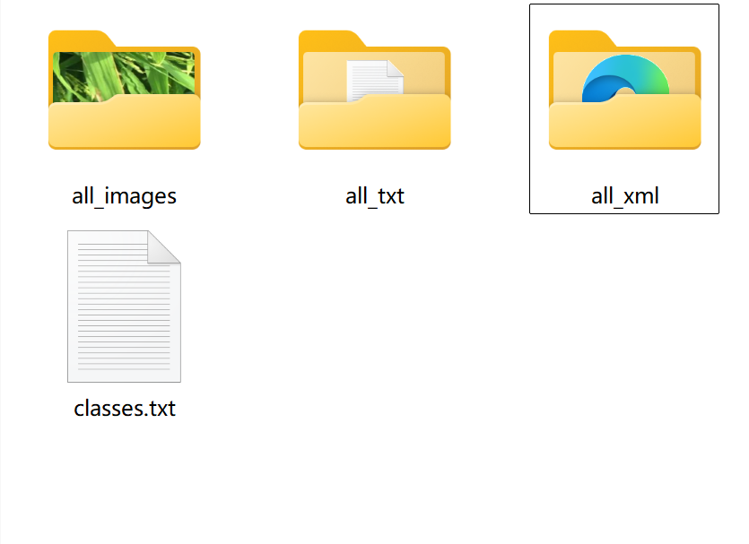
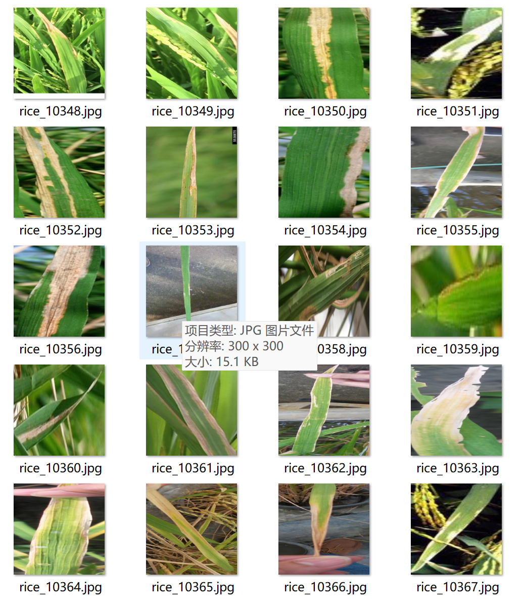
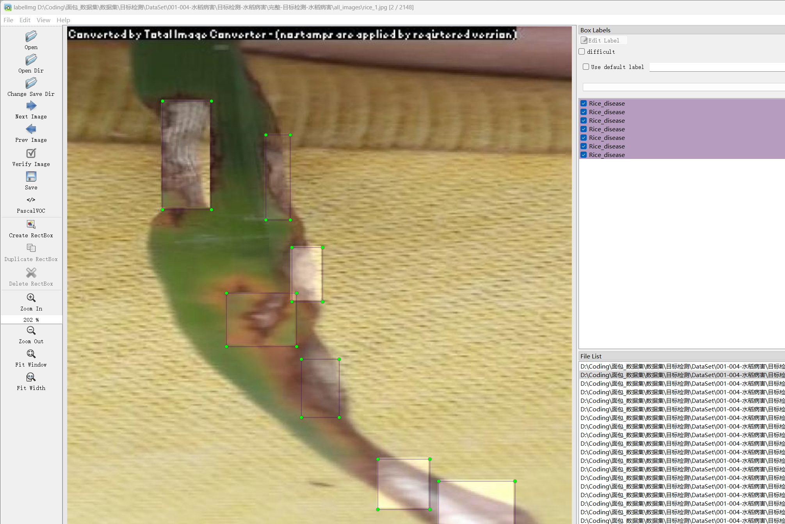

# Rice Leaf Disease Detection Dataset

Introduction to the dataset: The dataset consists of 2148 images and corresponding annotations. The annotation files are provided in two formats: VOC formatted with XML files and YOLO formatted with txt files.

The annotated objects include:
'Rice_disease'

The number of bounding box annotations is as follows: (Annotations are usually labeled in English, with Chinese provided in parentheses for reference)
Rice_disease: 6902 (Rice disease spots)

It is noted that multiple objects can be annotated within a single image, hence the total number of bounding box annotations may exceed the total number of images.

The complete dataset consists of three folders and one txt file:
- all_images folder: Stores the images of the dataset, screenshots included.
- All_txt folder and classes.txt: Stores the YOLO formatted txt annotations, the number of annotations matches the number of images. Each annotation file corresponds to an image.
- classes.txt:

For more detailed understanding of the YOLO format standard file, please search for it yourself on Baidu. In short, the number 0 in the list represents the name of the object at index 0 in the array in classes.txt.

All_xml folder: VOC formatted with XML annotation files. The number of annotation files matches the number of images. Each annotation file corresponds to an image.

For more detailed understanding of the VOC format standard file, please search for it yourself on Baidu.

Both formats of annotations can be used, choose one according to your preference.

Annotation effect screenshots included.

## Images

Here is a pay link on Stripe ( https://buy.stripe.com/3cs8yP7sY87d0vu9AB ). Please contact me lonlonago@foxmail.com after funding $89, and I will send you a complete data files , thank you!

